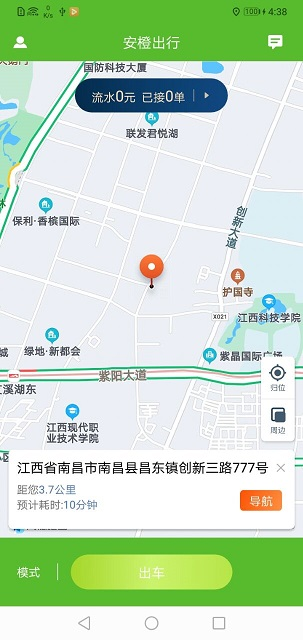

# 仿滴滴出行司机版(安卓版)
## 项目详情
此项目主要用户大巴车在线接单，项目难点主要是高德地图，自定义导航功能
## 主要功能包括
1.司机在线听取功能，查看地理位置功能，可在地图上选点并且导航，并且可以设置导航，可以查看路线，并且选择路线
2.查看个人信息，行程，流水，资质等功能
## 功能展示
  
#### 第三方框架主要采用 
okhttp MPChartLib retrofit  pickerview wheelview PictureSelector glide

